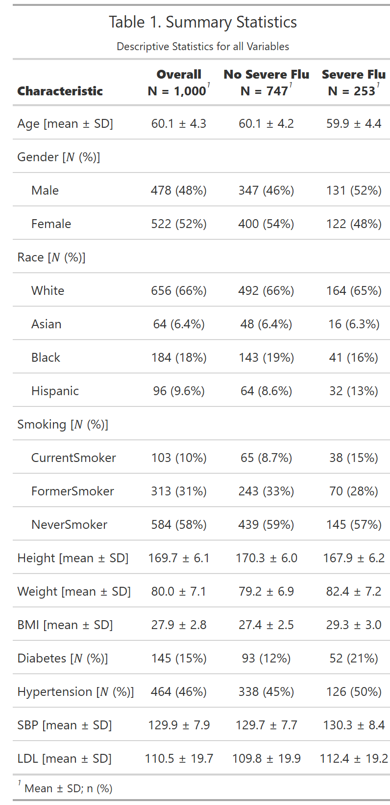
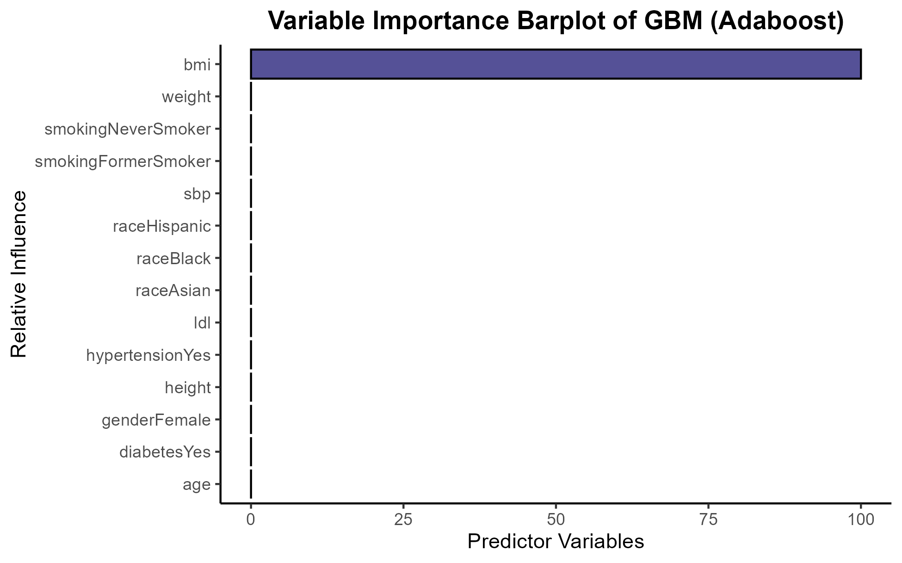

```{r setup, include=FALSE}
knitr::opts_chunk$set(
  echo = TRUE, message = FALSE, warning = FALSE,
  fig.align = "center")

library(tidyverse)
library(dplyr)
library(rsample)
library(caret)
library(ISLR)
library(kernlab)
library(factoextra)
library(gridExtra)
library(corrplot)
library(RColorBrewer)
library(gplots)
library(jpeg)
library(gt)
library(gtsummary)
library(tigris)
library(sf)
library(ggplot2)
library(labelled)
library(stats)
library(pROC)
library(car)

theme_set(
  theme_classic()+
    theme(plot.title = element_text(hjust = 0.5, face = "bold"))
)
```

**Data Import**
```{r}
# Raw data
flu = read_csv("data/severe_flu.csv") |> 
  janitor::clean_names()
```

```{r eval = FALSE}
# For summaries and visualizations
flu.summary = flu |> 
  select(-id) |> 
  set_value_labels(
    gender = c("Male" = 1, "Female" = 0),
    race = c("White" = 1, "Asian" = 2, "Black" = 3, "Hispanic" = 4),
    smoking = c("Never smoked" = 0, "Former smoker" = 1, "Current smoker" = 2),
    diabetes = c("No" = 0, "Yes" = 1),
    hypertension = c("No" = 0, "Yes" = 1),
    severe_flu = c("No" = 0, "Yes" = 1)) |> 
  mutate(across(is.labelled, to_factor))
```

```{r include = FALSE}
#saveRDS(flu.summary, file = "RDS/final_flu_summary_df.rds")
flu.summary = readRDS("RDS/final_flu_summary_df.rds")
```

## **Exploratory Analysis**

Summary table.
```{r eval = FALSE}
flu.summary.tbl = flu.summary |> 
  mutate(severe_flu = case_match(severe_flu, "no" ~ "No Severe Flu", "yes" ~ "Severe Flu")) |> 
  tbl_summary(
    by = severe_flu,
    statistic = list(all_continuous() ~ "{mean} ± {sd}"),
    digits = all_continuous() ~ 1,
    label = list(
      age ~ "Age [mean ± SD]",
      gender ~ "Gender  [𝑁 (%)]",
      race ~ "Race  [𝑁 (%)]",
      smoking ~ "Smoking  [𝑁 (%)]",
      height ~ "Height [mean ± SD]",
      weight ~ "Weight [mean ± SD]",
      bmi ~ "BMI [mean ± SD]",
      diabetes ~ "Diabetes  [𝑁 (%)]",
      hypertension ~ "Hypertension  [𝑁 (%)]",
      sbp ~ "SBP [mean ± SD]",
      ldl ~ "LDL [mean ± SD]")) |>
  add_overall() |>
  as_gt() |> 
  tab_style(
    style = cell_text(weight = "bold"),
    locations = cells_column_labels(everything())) |> 
  tab_header(
    title = "Table 1. Summary Statistics",
    subtitle = "Descriptive Statistics for all Variables") |> 
  tab_options(
    table.font.size = "small",
    heading.align = "center")

flu.summary.tbl
gtsave(flu.summary.tbl, "figures/flu_summary_categorized.png")
```



Exploratory Visualizations.
```{r}
plt.cont.summary = flu |> 
  select(id, age, height, weight, bmi, sbp, ldl) |> 
  pivot_longer(-id, names_to = "variable", values_to = "value") |> 
  ggplot(aes(x = value, fill = variable)) +
  geom_histogram(color = "black") +
  scale_fill_brewer(palette = "YlGnBu") +
  facet_wrap(~ variable, scale = "free_x") +
  labs(
    title = "Histograms of Continuous Variable Distributions") +
  theme(
    legend.position = "none",
    axis.title = element_blank())
plt.cont.summary

ggsave("figures/cont_vars_summary.png", plt.cont.summary, width = 10, height = 6, units = "in")
```

```{r}
plt.cat.summary = 
  flu.summary |> 
  select(gender, race, smoking, diabetes, hypertension, severe_flu) |> 
  mutate(smoking = str_replace(smoking, " ", "\n")) |> 
  pivot_longer(everything(), names_to = "variable", values_to = "value") |> 
  count(variable, value) |> 
  ggplot(aes(x = value, y = n, fill = variable)) +
  geom_bar(color = "black", stat = "identity") +
  scale_fill_brewer(palette = "YlGnBu") +
  facet_wrap(~ variable, scale = "free_x") +
  ylim(c(0, 900)) +
  geom_text(aes(label = paste0(n, " (", round(100*n/nrow(flu), 1) ,"%)")
                ), vjust = -0.5, size = 2.5) +
  labs(
    title = "Bar Plots of Categorical Variables") +
  theme(
    legend.position = "none",
    axis.title = element_blank())
plt.cat.summary

ggsave("figures/cat_vars_summary.png", plt.cat.summary, width = 10, height = 6, units = "in")
```

```{r}
plt.cont.byflu = flu.summary |> 
  select(severe_flu, age, height, weight, bmi, sbp, ldl) |> 
  pivot_longer(-severe_flu, names_to = "variable", values_to = "value") |> 
  ggplot(aes(x = value, fill = as.factor(severe_flu))) +
  geom_histogram(color = "black", position = "dodge", bins = 20) +
  facet_wrap(~ variable, scale = "free_x") +
  #scale_fill_brewer(palette = "Paired") +
  scale_fill_manual(values = brewer.pal(n = 9, name = "YlGnBu")[c(1,5)]) +
  labs(
    title = "Continuous Variable Distributions by Flu Status",
    fill = "Severe Flu") +
  theme(
    legend.position = "bottom",
    axis.title = element_blank())
plt.cont.byflu

ggsave("figures/cont_vars_byflu_6x3.png", plt.cont.byflu, width = 6, height = 3, units = "in")
```

```{r}
plt.cat.byflu = 
  flu.summary |> 
  select(gender, race, smoking, diabetes, hypertension, severe_flu) |> 
  mutate(smoking = str_replace(smoking, " ", "\n")) |> 
  pivot_longer(-severe_flu, names_to = "variable", values_to = "value") |> 
  ggplot(aes(x = value, fill = as.factor(severe_flu))) +
  geom_bar(color = "black") +
  facet_wrap(~ variable, scale = "free_x") +
  #scale_fill_brewer(palette = "Paired") +
  scale_fill_manual(values = brewer.pal(n = 9, name = "YlGnBu")[c(1,5)]) +
  labs(
    title = "Continuous Variable Distributions by Flu Status",
    fill = "Severe Flu") +
  theme(
    legend.position = "bottom",
    axis.title = element_blank())
plt.cat.byflu

ggsave("figures/cat_vars_byflu_6x3.png", plt.cat.byflu, width = 6, height = 3, units = "in")
```

Corr Plot
```{r}
plt.cor = flu |> 
  select(-id) |> 
  cor() |> 
  GGally::ggcorr(method = "pairwise")
plt.cor

ggsave("figures/corplot.png", plt.cor, width = 8, height = 8, units = "in")
```

## **Simple Models**

#### **Setup**

Split Data
```{r}
# Prep Data
flu.summary$severe_flu = factor(
  tolower(as.character(flu.summary$severe_flu)),
  levels = c("no", "yes"))

flu.summary$smoking = str_replace(flu.summary$smoking, " smoke[rd]", "Smoker")

# Split Data
set.seed(2025)
data.split = initial_split(flu.summary, prop = 0.8)
train.dat = training(data.split)
test.dat = testing(data.split)

x = model.matrix(severe_flu~ ., train.dat)[-1]#remove the first column
y = train.dat$severe_flu
```

Cross-Validation Setup
```{r}
set.seed(2025)
ctrl = trainControl(method = "cv",
                    number = 10,
                    classProbs = TRUE,
                    summaryFunction = twoClassSummary)
```

#### **GLM**
```{r eval = FALSE}
set.seed(2025)
glm.fit = train(severe_flu ~ .,
                data = train.dat,
                method = "glm",
                family = "binomial",
                trControl = ctrl,
                metric = "ROC")
```

```{r include = FALSE}
#saveRDS(glm.fit, file = "RDS/final_glm.rds")
glm.fit = readRDS("RDS/final_glm.rds")
```

```{r}
summary(glm.fit)
glm.fit$finalModel$fitted.values[1:10]
```

Diagnostics
```{r}
vif(glm.fit$finalModel)

# plot(glm.fit$finalModel$fitted.values, residuals(glm.fit$finalModel, type = "deviance"),
#      xlab = "Fitted values", ylab = "Deviance residuals",
#      main = "Deviance Residuals vs Fitted")
# abline(h = 0, lty = 2)
```

#### **ENET**

```{r eval = FALSE}
# Train Model
set.seed(2025)
enet.fit = train(severe_flu ~ .,
                data = train.dat,
                method = "glmnet",
                family = "binomial",
                trControl = ctrl,
                metric = "ROC",
                tuneGrid = expand.grid(
                  alpha = seq(0, 1, length = 21),
                  lambda = exp(seq(9, -3, length = 100))))
```

```{r include = FALSE}
#saveRDS(enet.fit, file = "RDS/final_enet.rds")
enet.fit = readRDS("RDS/final_enet.rds")
```

```{r}
enet.fit$bestTune
coef(enet.fit$finalModel, s = enet.fit$bestTune$lambda)
```

```{r}
par(mfrow = c(1, 1)) # reset plotting grid afterwards
plot(enet.fit, xTrans = log)
```

#### **PLS**
```{r eval = FALSE}
# Train Model
set.seed(2025)
pls.fit = train(severe_flu ~ .,
                data = train.dat,
                method = "pls",
                family = "binomial",
                trControl = ctrl,
                metric = "ROC",
                tuneGrid = data.frame(ncomp = 1:14),
                preProcess = c("center", "scale"))
```

```{r include = FALSE}
#saveRDS(pls.fit, file = "RDS/final_pls.rds")
pls.fit = readRDS("RDS/final_pls.rds")
```

```{r}
pls.fit$bestTune #best_ncomp
coef(pls.fit$finalModel, s = pls.fit$bestTune$ncomp) |> 
  as.data.frame() |> 
  arrange(-abs(`no.9 comps`))
ggplot(pls.fit, highlight = TRUE) + theme_bw()
```

#### **GAM**
```{r eval = FALSE}
# Train Model
set.seed(2025)
gam.fit = train(severe_flu ~ .,
                data = train.dat,
                method = "gam",
                family = "binomial",
                trControl = ctrl,
                metric = "ROC")
```

```{r include = FALSE}
#saveRDS(gam.fit, file = "RDS/final_gam.rds")
gam.fit = readRDS("RDS/final_gam.rds")
```

```{r}
summary(gam.fit)

coef(gam.fit$finalModel, s = gam.fit$bestTune)

plot(gam.fit$finalModel, pages = 1, shade = TRUE, seWithMean = TRUE)
```

#### **MARS**
```{r eval = FALSE}
# Train Model
mars_grid = expand.grid(degree = 1:4, nprune = 2:20)
set.seed(2025)
mars.fit = train(severe_flu ~ .,
                data = train.dat,
                method = "earth",
                glm=list(family=binomial),
                trControl = ctrl,
                metric = "ROC",
                tuneGrid = mars_grid)
```

```{r include = FALSE}
#saveRDS(mars.fit, file = "RDS/final_mars.rds")
mars.fit = readRDS("RDS/final_mars.rds")
```

```{r}
summary(mars.fit)
mars.fit$bestTune

coef(mars.fit$finalModel)

ggplot(mars.fit)
```

## **Complex Models**

#### **Boosting: Adaboost**
```{r eval = FALSE}
# Get Tune Grid
gbm.grid = expand.grid(n.trees = c(100,200,500,1000,2000),
  interaction.depth = 1:5,
  shrinkage = c(0.001, 0.003, 0.005),
  n.minobsinnode = 10)

# Train GBM
set.seed(2025)
gbm.fit = train(severe_flu ~ .,
               data = train.dat,
               tuneGrid = gbm.grid,
               trControl = ctrl,
               method = "gbm",
               distribution = "adaboost",
               metric = "ROC",
               verbose = FALSE)
```

**Boosting: Simpler with Bernoulli**
```{r eval = FALSE}
# SMALLER RUN
gbm.grid1 = expand.grid(
  n.trees = c(100, 200, 500, 1000),
  interaction.depth = c(1:5),
  shrinkage = c(0.01, 0.03, 0.05),
  n.minobsinnode = 10)

# Train GBM
set.seed(2025)
gbm.fit1 = train(severe_flu ~ .,
               data = train.dat,
               tuneGrid = gbm.grid1,
               trControl = ctrl,
               method = "gbm",
               distribution = "bernoulli",
               metric = "ROC",
               verbose = TRUE)
```

```{r include = FALSE}
#saveRDS(gbm.fit, file = "RDS/final_gbm.rds")
gbm.fit = readRDS("RDS/final_gbm.rds")

#saveRDS(gbm.fit1, file = "RDS/final_gbm1.rds")
gbm.fit1 = readRDS("RDS/final_gbm1.rds")
```

Bernoulli
```{r}
# Model Summaries
summary(gbm.fit1)
gbm.fit1$bestTune
ggplot(gbm.fit1, highlight = TRUE)

# Variable Importance
summary(gbm.fit1, las = 2, cBars = 16, cex.names = 0.6)
```

Adaboost
```{r}
# Model Summaries
summary(gbm.fit)
gbm.fit$bestTune
ggplot(gbm.fit, highlight = TRUE)

# Variable Importance
summary(gbm.fit, las = 2, cBars = 16, cex.names = 0.6)
```

Variable dependence plot for Bernoulli GBM
```{r eval = FALSE}
plt.gbm1.vip = summary(gbm.fit1$finalModel, plotit = FALSE) |> 
  as_tibble() |> 
  mutate(var = fct_reorder(.f = var, .x = rel.inf, .fun = min)) |> 
  ggplot(aes(x = var, y = rel.inf, fill = var)) + 
  geom_bar(stat = "identity", color = "black") + 
  scale_fill_manual(values = colorRampPalette(colors = c("lightblue","darkslateblue"))(16)) +
  coord_flip() + 
  labs(
    title = "Variable Importance Barplot of GBM (Bernoulli)",
    x = "Relative Influence",
    y = "Predictor Variables") +
  theme(legend.position = "none")
plt.gbm1.vip
ggsave("figures/vip_gbm_bern.png", plt.gbm1.vip)
```


Variable dependence plot for Bernoulli Adaboost
```{r eval = FALSE}
plt.gbm.vip = summary(gbm.fit$finalModel, plotit = FALSE) |> 
  as_tibble() |> 
  mutate(var = fct_reorder(.f = var, .x = rel.inf, .fun = min)) |> 
  ggplot(aes(x = var, y = rel.inf, fill = var)) + 
  geom_bar(stat = "identity", color = "black") + 
  scale_fill_manual(values = colorRampPalette(colors = c("lightblue","darkslateblue"))(16)) +
  coord_flip() + 
  labs(
    title = "Variable Importance Barplot of GBM (Adaboost)",
    x = "Relative Influence",
    y = "Predictor Variables") +
  theme(legend.position = "none")
plt.gbm.vip
ggsave("figures/vip_gbm_ada.png", plt.gbm.vip)
```



#### **SVM: Linear Kernel**
```{r eval = FALSE}
# Train Model
set.seed(2025)
svml.fit = train(severe_flu ~ .,
                data = train.dat,
                method = "svmLinear",
                family = "binomial",
                trControl = ctrl,
                metric = "ROC", 
                tuneGrid = data.frame(C = exp(seq(-5, 2, len = 50))))
```

```{r include = FALSE}
#saveRDS(svml.fit, file = "RDS/final_svml.rds")
svml.fit = readRDS("RDS/final_svml.rds")
```

```{r}
summary(svml.fit)
svml.fit$bestTune
coef(svml.fit$finalModel)[[1]][1:20]
# Visualize
plot(svml.fit, highlight = TRUE)
```


#### **SVM: Radial Kernel**
```{r eval = FALSE}
# Set tuning grid
svmr.grid = expand.grid(C = exp(seq(1, 7, len = 50)),
                        sigma = exp(seq(-10, -2, len = 20)))

# Train Model
set.seed(2025)
svmr.fit = train(severe_flu ~ .,
                data = train.dat,
                method = "svmRadialSigma",
                family = "binomial",
                trControl = ctrl,
                metric = "ROC", 
                tuneGrid = svmr.grid)
```

```{r include = FALSE}
#saveRDS(svmr.fit, file = "RDS/final_svmr.rds")
svmr.fit = readRDS("RDS/final_svmr.rds")
```

```{r}
summary(svmr.fit)
svmr.fit$bestTune

# Visualize
myCol = rainbow(25)
myPar = list(superpose.symbol = list(col = myCol),
  superpose.line = list(col = myCol))

plot(svmr.fit, highlight = TRUE, par.settings = myPar)
```


## **Model Comparison**

**BW Plots**
```{r}
set.seed(2025)
resamp = resamples(list(GLM = glm.fit,
                        ENET = enet.fit,
                        PLS = pls.fit,
                        GAM = gam.fit, 
                        MARS = mars.fit,
                        GBM.ada = gbm.fit,
                        GBM.bern = gbm.fit1,
                        SVML = svml.fit,
                        SVMR = svmr.fit))
summary(resamp)
bwplot(resamp, metric = "ROC", main = "Model Comparison Box Plots")
```


**ROC Curves**
```{r eval = FALSE}
# pred.GLM = predict(glm.fit, newdata = test.dat, type = "prob")[,"yes"]
# pred.ENET = predict(enet.fit, newdata = test.dat, type = "prob")[,"yes"]
# pred.PLS = predict(pls.fit, newdata = test.dat, type = "prob")[,"yes"]
# pred.GAM = predict(gam.fit, newdata = test.dat, type = "prob")[,"yes"]
# pred.MARS = predict(mars.fit, newdata = test.dat, type = "prob")[,"yes"]
# pred.GBM.ada = predict(gbm.fit, newdata = test.dat, type = "prob")[,"yes"]
# pred.GBM.bern = predict(gbm.fit1, newdata = test.dat, type = "prob")[,"yes"]
# pred.SVML = predict(svml.fit, newdata = test.dat, type = "prob")[,"yes"]
# pred.SVMR = predict(svmr.fit, newdata = test.dat, type = "prob")[,"yes"]

# models = list(glm.fit, enet.fit, pls.fit, gam.fit, mars.fit, # simple models
#               gbm.fit, gbm.fit1, svml.fit, svmr.fit) # complex models
```

ROC Curve for Train Set
```{r}
# Save all models together (in order of AUC)
models = list(
  GLM = glm.fit,
  ENET = enet.fit,
  PLS = pls.fit,
  GAM = gam.fit,
  MARS = mars.fit,
  GBM.bern = gbm.fit1,
  GBM.ada = gbm.fit,
  SVML = svml.fit,
  SVMR = svmr.fit)

predictions = purrr::map(.x = models, ~ predict(.x, newdata = train.dat, type = "prob")[,"yes"])

roc = purrr::map(.x = predictions, ~roc(train.dat$severe_flu, .x)) |> 
  suppressMessages()

auc = purrr::map_dbl(roc, "auc")


# Plot all on the curve
my.cols = RColorBrewer::brewer.pal(n = 11, name = "Spectral")[c(1:5, 8:11)]
plot(roc[[1]], col = my.cols[1], main = "ROC Curves Comparison (TRAIN SET)", xlim = c(1,0), ylim = c(0,1))
purrr::walk2(roc[-1], 2:length(roc), ~plot(.x, add = TRUE, col = my.cols[.y]))

legend("bottomright", legend = paste0(names(models), ": ", round(auc,3)),
col = my.cols[1:9], lwd = 2)
```


ROC Curve for Test Set
```{r}
# Save all models together (in order of AUC)
models = list(
  GLM = glm.fit,
  ENET = enet.fit,
  PLS = pls.fit,
  GAM = gam.fit,
  MARS = mars.fit,
  GBM.bern = gbm.fit1,
  GBM.ada = gbm.fit,
  SVML = svml.fit,
  SVMR = svmr.fit)

predictions = purrr::map(.x = models, ~ predict(.x, newdata = test.dat, type = "prob")[,"yes"])

roc = purrr::map(.x = predictions, ~roc(test.dat$severe_flu, .x)) |> 
  suppressMessages()

auc = purrr::map_dbl(roc, "auc")


# Plot all on the curve
my.cols = RColorBrewer::brewer.pal(n = 11, name = "Spectral")[c(1:5, 8:11)]
plot(roc[[1]], col = my.cols[1], main = "ROC Curves Comparison (TEST SET)", xlim = c(1,0), ylim = c(0,1))
purrr::walk2(roc[-1], 2:length(roc), ~plot(.x, add = TRUE, col = my.cols[.y]))

legend("bottomright", legend = paste0(names(models), ": ", round(auc,3)),
col = my.cols[1:9], lwd = 2)
```

## **Final Model: SVML**

ROC Curve for Test Set
```{r}
# Plot all on the curve
plot(roc[["SVML"]], col = my.cols[1], main = "ROC Curve for SVML", xlim = c(1,0), ylim = c(0,1))

legend("bottomright", legend = paste0("SVML: ", round(auc[["SVML"]],3)),
col = my.cols[1:9], lwd = 2)
```

## **Get Predictive Probabilities (Risk Scores)**

Plot predictive scores.
```{r}
svml.pr = predict(svml.fit, newdata = test.dat, type = "prob")
svml.pr$yes |> fivenum()
```

Visualize distribution of scores.
```{r}
ggplot(data.frame(prob = svml.pr$yes), aes(x = prob)) +
  geom_histogram(binwidth = 0.05, fill = "cornflowerblue", color = "black", alpha = 0.5) +
  labs(title = "Predicted Risk of Severe Flu",
       x = "Predicted Probability",
       y = "Number of Participants")
```


## 


