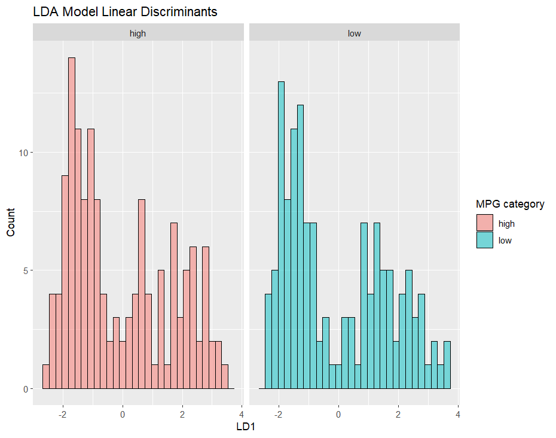

```{r include = FALSE}
knitr::opts_chunk$set(message = FALSE, warning = FALSE)
```

```{r}
library(tidyverse)
library(ggplot2)
library(dplyr)
library(caret)
library(rsample)
library(car)
library(earth)
library(pROC)
```


In this problem, you will develop a model to predict whether a given car gets high or low gas mileage based on the dataset “auto.csv”. The dataset contains 392 observations. The response variable is “mpg cat”, which indicates whether the miles per gallon of a car is high or low. The predictors include both continuous and categorical variables: 

* cylinders: Number of cylinders between 4 and 8
* displacement: Engine displacement (cu. inches)
* horsepower: Engine horsepower
* weight: Vehicle weight (lbs.)
* acceleration: Time to accelerate from 0 to 60 mph (sec.)
* year: Model year (modulo 100)
* origin: Origin of car (1. American, 2. European, 3. Japanese)

**Split the dataset into two parts: training data (70%) and test data (30%).**

```{r}
auto = read_csv("data/auto.csv")

set.seed(2025)

# Split Data
data_split = initial_split(auto, prop = 0.7)
training_data = training(data_split)
testing_data = testing(data_split)

# Cross Validation Setup
ctrl1 = trainControl(method = "cv",
                     number = 10,
                     classProbs = TRUE,
                     summaryFunction = twoClassSummary)
```

**(a) Perform logistic regression analysis. Are there redundant predictors in your model? If so, identify them. If there are none, please provide an explanation.**

Train model.
```{r}
set.seed(2025)

log_model = train(
  mpg_cat ~ .,
  data = training_data,
  method = "glm",
  family = "binomial",
  trControl = ctrl1,
  metric = "ROC"
)

summary(log_model$finalModel)
```

Check for redundant predictors. Based on this, it appears there may be some redundant predictors. The variables cylinders and weight have moderate but likely acceptable correlation, since their VIF outputs are below 5. The variables horsepower, acceleration, year, and origin also have no multicollinearity issue, since their VIF outputs are even lower. However, the displacement variable does have a potential multicollinearity issue, since its VIF output is over 5.
```{r}
vif(log_model$finalModel)
```

Train penalized logistic regression model, to see if the optimal model prefers a stronger L1 penalty. Based on the best tune result showing lambda=0.7 below, we can infer that the model prefers to drop redundant variables.
```{r}
glmnGrid = expand.grid(.alpha = seq(0, 1, length = 21),
                        .lambda = exp(seq(-8, -1, length = 50)))

glmn_model = train(x = training_data[1:7],
                   y = training_data$mpg_cat,
                   method = "glmnet",
                   tuneGrid = glmnGrid,
                   metric = "ROC",
                   trControl = ctrl1)

glmn_model$bestTune

coef(glmn_model$finalModel, s = glmn_model$bestTune$lambda)
```

Since acceleration and origin were dropped from the model, seeing as their coefficients are 0 below, we can conclude that those were the redundant predictors.

Visualize training.
```{r}
myCol = rainbow(25)
myPar = list(superpose.symbol = list(col = myCol),
             superpose.line = list(col = myCol))
plot(glmn_model, par.settings = myPar, xTrans = function(x) log(x))
```

**(b) Train a multivariate adaptive regression spline (MARS) model. Does the MARS model improve prediction performance compared to logistic regression?**

```{r}
set.seed(2025)
mars_grid = expand.grid(degree = 1:4, nprune = 2:20)
mars_model = train(x = training_data[1:7],
                 y = training_data$mpg_cat,
                 method = "earth",
                 tuneGrid = mars_grid,
                 trControl = ctrl1,
                 metric = "ROC")

summary(mars_model)
```

Optimal tuning parameters.
```{r}
mars_model$bestTune
```

Optimal model.
```{r}
coef(mars_model$finalModel)
```

Visualize.
```{r}
ggplot(mars_model)
```

Compare models. Based on the results below, it looks like the MARS model has the highest mean and median ROC, indicating that it has the best ability to discriminate between "high" and "low" mpg_cat.
```{r}
resamp = resamples(list(MARS = mars_model,
                        LOG = log_model,
                        GLMNET = glmn_model))
summary(resamp)

bwplot(resamp)
```

**(c) Perform linear discriminant analysis using the training data. Plot the linear discriminant(s).**

Train LDA model.
```{r}
set.seed(2025)
lda_model = train(x = training_data[1:7],
                 y = training_data$mpg_cat,
                 method = "lda",
                 trControl = ctrl1,
                 metric = "ROC")

lda_model$finalModel
```

```{r eval = FALSE}
# extract final LDA model
lda_final_model = lda_model$finalModel

# get linear discriminants
lda_scores = predict(lda_final_model)$x

# add true class labels to scores for coloring in later plot
lda_scores = data.frame(lda_scores, mpg_cat = training_data$mpg_cat)

# plot first two linear discriminants (LD1 and LD2)
ggplot(lda_scores, aes(x = LD1, fill = mpg_cat)) +
  geom_histogram(position = "dodge", color = "black", lwd = 0.5, alpha = 0.5) +
  labs(title = "LDA Model Linear Discriminants",
       x = "LD1",
       y = "Count",
       fill = "MPG category") +
  facet_grid(~ mpg_cat)
```



**(d) Which model will you choose to predict the response variable? Plot its ROC curve and report the AUC. Next, select a probability threshold to classify observations and compute the confusion matrix. Briefly interpret what the confusion matrix indicates about your model’s performance.**

Compare models again. Based on the results below, it looks like the MARS model still has the highest mean and median ROC, indicating that it has the best ability to discriminate between "high" and "low" mpg_cat.
```{r}
resamp = resamples(list(MARS = mars_model,
                        LOG = log_model,
                        GLMNET = glmn_model,
                        LDA = lda_model))
summary(resamp)

bwplot(resamp)
```

MARS model ROC curve.
```{r}
# predict probabilities on test data using MARS model
mars_pred_prob = predict(mars_model, newdata = testing_data, type = "prob")

# positive class is "high" mpg
test_pred_prob = mars_pred_prob$high  

# Generate ROC curve
roc_mars = roc(testing_data$mpg_cat, test_pred_prob)

# =lot ROC curve and smoothed ROC curve
plot(roc_mars, legacy.axes = TRUE, print.auc = TRUE)
plot(smooth(roc_mars), col = 4, add = TRUE)
```

Generate confusion matrix.
```{r}
# set threshold and classify observations
threshold = 0.5
test_pred = ifelse(test_pred_prob > threshold, "high", "low")

# compute confusion matrix
conf_matrix = confusionMatrix(data = as.factor(test_pred),
                reference = as.factor(testing_data$mpg_cat),
                positive = "high")

conf_matrix
```

Based on this confusion matrix, we can see that when applied to the test data, the MARS model correctly predicted 49 true positives and 56 true negatives, compared to 7 false positives and 6 false negatives.

The overall accuracy of the model, based on assessment using the testing data, is 88.98%, which is the proportion of predictions that were made correctly. The 95% confidence interval tells us that we are 95% confident that the true accuracy is between 81.9% and 94%.

The no information rate of 0.5339 tells us the accuracy that the model would have if it were to always predict only the most frequent class. When compared with the accuracy, this shows us that the MARS model performs better than random guessing.

Finally, the p-value is very small, telling us that the model is significantly better than a randomly guessing model.


